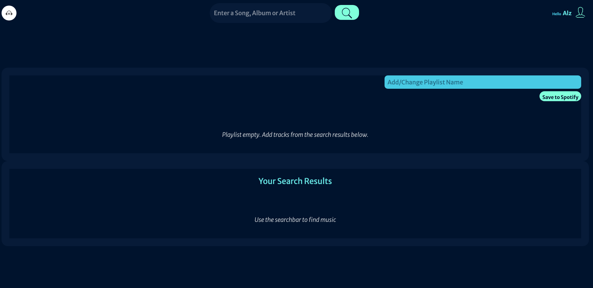
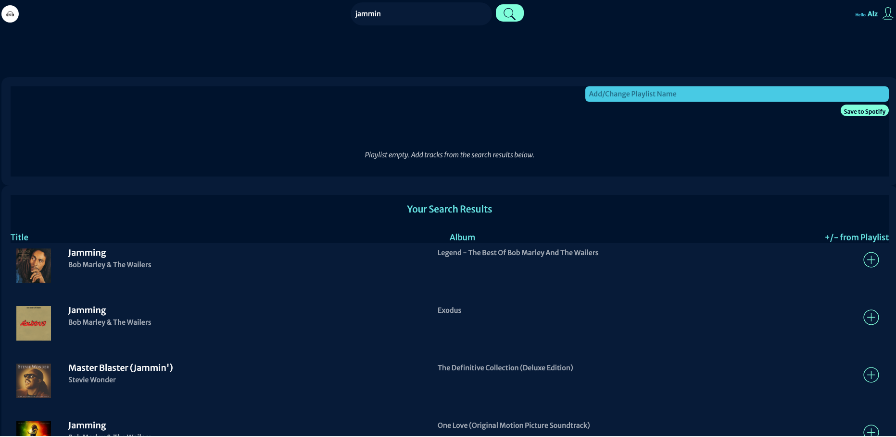
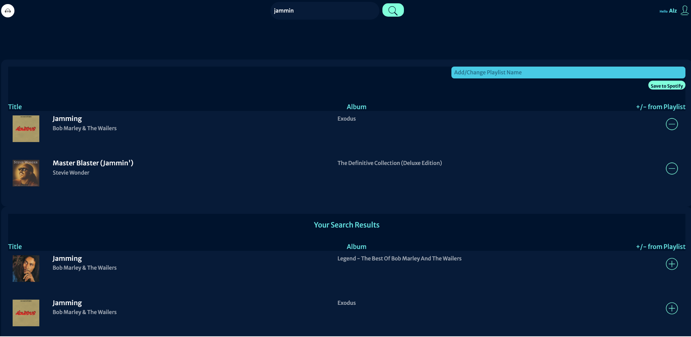
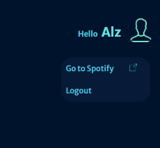

# Jammin App

## Description

This app is built using HTML, CSS, JavaScript and React. It allows a user to search Spotify for a song, add that song to a playlist and save the custom playlist to their spotify account via the Spotify API using their Spotify login credentials.

### Main Features

The main features of the app are:

- Single-click login screen
- Welcome user by name once logged in
- Dashboard with sections to manage search, search results and the playlist
- Search by artist or song or keyword
- Assign a unique name for the playlist
- Single-click to save playlist to users' Spotify account

## How to Use App

App can be initialised by running `$ npm dev` in the project root folder.

Once initialised the user is presented with the app landing page

</img>

Clicking on the 'Login with Spotify' button redirects the user to the Spotify login page to enter their credentials. Once logged in the user is redirected to to the apps main interface.

</img>

The user can search for song titles / artists / keywords in the search bar. The top search results are displayed with track info including artist, album and album art.

</img>

The user can add songs to the playlist section using the "Add" button beside each song in the search results section. Songs can be removed from the playlist using the "Remove" button beside each song in the playlist section.

</img>

Users can give their playlist a name and save the playlist to their Spotify account by clicking on the Save to Spotify button in the playlist section.

Users can navigate to the Spotify webapp or logout of the app using the user menu in the top right-hand corner of the screen

</img>
